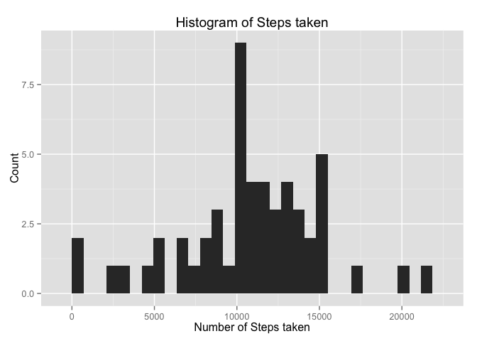
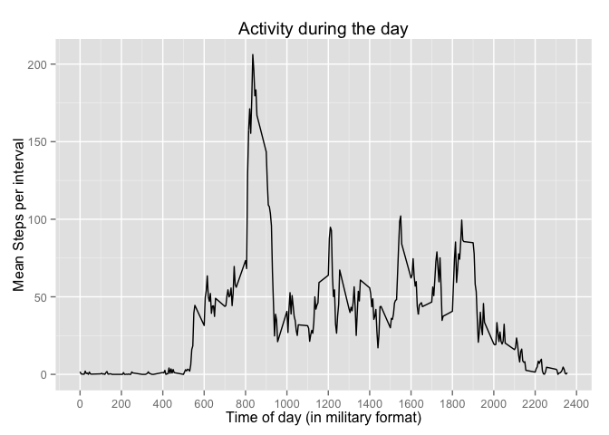
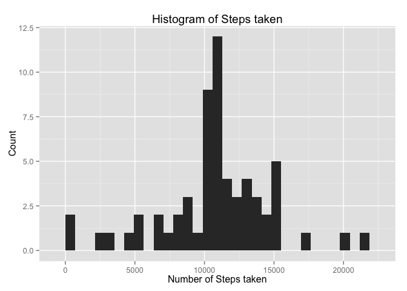
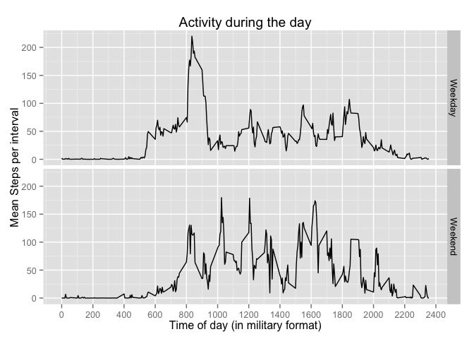

# Reproducible Research 1
CA  
January 7, 2016  


# Assignment 1

## Loading and pre-processing data

In the following, the data is loaded and prepared for the analysis (cleaning, formatting, etc.).


```r
# Loading data
dat <- read.csv("activity.csv")
# Reformat interval and then make date stamp
dat$interval <- sprintf("%04.0f", dat$interval)
dat$date <- ymd(dat$date)
```

## Mean and median total number of days

Now the data is summarized by calculating the daily means and plotting a histogram, as well as computing the mean and median.


```r
# Steps per day
perday <- dat %>% group_by(date) %>% summarize(steps = sum(steps))

# Histogram
ggplot(data = perday, aes(steps)) + geom_histogram() + xlab("Number of Steps taken") + ylab("Count") + ggtitle("Histogram of Steps taken")
```

```
## stat_bin: binwidth defaulted to range/30. Use 'binwidth = x' to adjust this.
```

 

```r
# Mean and Median
perday %>% summarize(mean.steps = mean(steps, na.rm = TRUE), median.steps = median(steps, na.rm = TRUE))
```

```
## Source: local data frame [1 x 2]
## 
##   mean.steps median.steps
##        (dbl)        (int)
## 1   10766.19        10765
```

## Daily activity pattern


```r
# Average steps per interval
act.int <- dat %>% group_by(interval) %>% summarize(mean.act = mean(steps, na.rm = TRUE))

# Line plot
ggplot(data = act.int, aes(x = as.numeric(interval), y = mean.act)) + geom_line() + xlab("Time of day (in military format)") + 
  ylab("Mean Steps per interval") + ggtitle("Activity during the day") + scale_x_continuous(breaks = seq(0,2400,200))
```

 

```r
# Max steps interval
act.int %>% top_n(1, mean.act)
```

```
## Source: local data frame [1 x 2]
## 
##   interval mean.act
##      (chr)    (dbl)
## 1     0835 206.1698
```

## Inputting missing values

The strategy employed here is very simple: the NA value is replaced with the mean for the respective interval.


```r
# Count NAs
dat %>% summarize(NAs = sum(is.na(steps)))
```

```
##    NAs
## 1 2304
```

```r
# Creat new data set and fill in with mean for that day
ndat <- dat
for(i in 1:nrow(ndat)){
  if(is.na(ndat$steps[i])){
    ndat$steps[i] <- act.int$mean.act[act.int$interval == ndat$interval[i]]
  }
}

# Histogram
nperday <- ndat %>% group_by(date) %>% summarize(steps = sum(steps))
ggplot(data = nperday, aes(steps)) + geom_histogram() + xlab("Number of Steps taken") + ylab("Count") + ggtitle("Histogram of Steps taken")
```

```
## stat_bin: binwidth defaulted to range/30. Use 'binwidth = x' to adjust this.
```

 

```r
# Mean and Median
nperday %>% summarize(mean.steps = mean(steps, na.rm = TRUE), median.steps = median(steps, na.rm = TRUE))
```

```
## Source: local data frame [1 x 2]
## 
##   mean.steps median.steps
##        (dbl)        (dbl)
## 1   10766.19     10766.19
```

## Weekend vs. weekday activity patterns

Using the new dataset *ndat* for this.


```r
ndat <- ndat %>% mutate(weekend = factor(ifelse(weekdays(date, TRUE) == "Sun" | weekdays(date, TRUE) == "Sun", "Weekend", "Weekday")))
# Line plot
nact.int <- ndat %>% group_by(interval, weekend) %>% summarize(mean.act = mean(steps, na.rm = TRUE))
ggplot(data = nact.int, aes(x = as.numeric(interval), y = mean.act)) + geom_line() + xlab("Time of day (in military format)") + 
  ylab("Mean Steps per interval") + ggtitle("Activity during the day") + scale_x_continuous(breaks = seq(0,2400,200)) + facet_grid(weekend ~ .)
```

 

EOF

